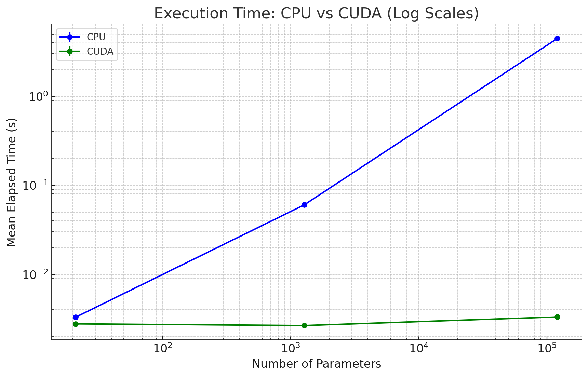

# micrograd CUDA


Teaching myself basic CUDA by building GPU-accelerated tensor-based autodiff from the ground up, inspired by [Andrej's micrograd](https://github.com/karpathy/micrograd/tree/master).

No dependencies other than Python's standard library and CUDA.

## Compiling

To compile the CUDA kernels:

```bash
nvcc -shared -o liboperations.so micrograd_cuda/operations.cu -Xcompiler -fPIC
```

## Usage

```python
import random
import time

from micrograd_cuda.mlp import MLP
from micrograd_cuda.tensor import Tensor
from micrograd_cuda.operations import Operations

# Model
model = MLP(100, [100, 100, 1])
epochs = 20
device = "cpu"

# Data
xs_batch = Tensor([[random.choice([-1, 1]) for _ in range(100)] for _ in range(10)]).T
ys_batch = Tensor([[random.choice([-1, 1])] for _ in range(10)]).T

# Move to device
model.to(device)
xs_batch.to(device)
ys_batch.to(device)

start = time.time()

for k in range(epochs):

    # Forward pass
    ypred = model(xs_batch)
    diff = ypred - ys_batch
    loss = (diff**2).sum()

    # Backward pass
    for p in model.parameters():
        p.zero_grad()
        
    loss.backward()
    
    # Update
    for p in model.parameters():
        p.data = (-0.1 * p.grad + p).data_copy()

print(f"Elapsed: {time.time() - start:.2f} sec")
    
loss.to("cpu")
print(loss.data)
```

## Speedup



## Roadmap

The codebase is still WIP with some rough spots, especially around CUDA Tensor data manipulation and copying.

- [x] Micrograd extension with basic 2D tensors and naïve matrix multiplication for MLP
- [x] Batching
- [x] CUDA kernel for matrix multiplication
- [x] Less verbose code
- [ ] Error handling
- [ ] CUDA optimizations
- [ ] >2D tensors

## Running tests

```bash
python -m pytest
```

## License

MIT
